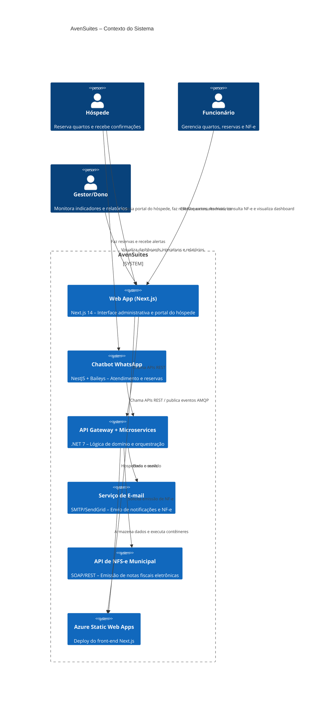
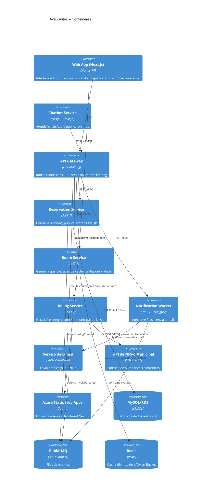
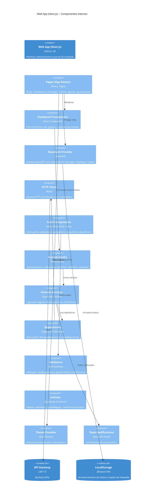
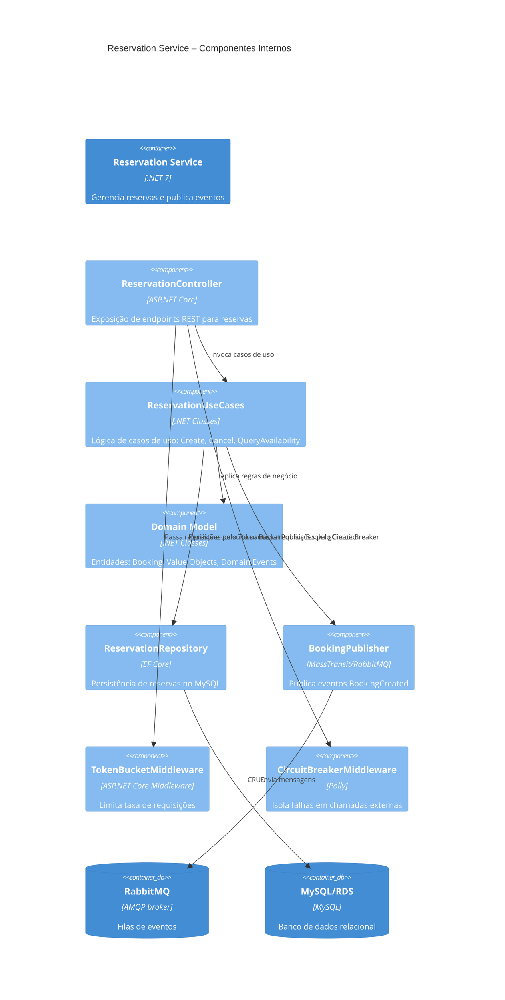

# Capa

- **Título do Projeto**: AvenSuites – Gestão de Quartos, Reservas e Emissão de NF-e com Chatbot WhatsApp
- **Nome do Estudante**: Gustavo José Rosa
- **Curso**: Engenharia de Software
- **Data de Entrega**: [Data]

# Resumo

Gerenciar quartos, reservas, faturamento e atendimento em canais distintos é um processo fragmentado e sujeito a erros. Equipes hoteleiras perdem tempo sincronizando sistemas, emitindo NF-e manualmente e enviando lembretes, enquanto a satisfação do hóspede cai devido a confirmações tardias e falta de informações centralizadas.

**AvenSuites** surge para acabar com esse gargalo. Nossa plataforma unificada oferece:

- **Interface Web Moderna** com Next.js 14, dashboard interativo em tempo real e design responsivo
- **Reservas 24/7** via web e WhatsApp (Baileys)
- **Emissão automática de NF-e** com integração direta ao ERP fiscal
- **Notificações inteligentes**: e-mail de NF-e e lembrete de check-out
- **Orquestração segura** com RabbitMQ, Token Bucket e Circuit Breaker
- **Dashboards em tempo real** alimentados por cache Redis
- **Portal do Hóspede** separado com autenticação dedicada
- **Deploy contínuo** (Azure Static Web Apps/Vercel) com CI/CD e conformidade à LGPD

Importante ressaltar: o AvenSuites não é um CRM completo — nosso foco é otimizar a operação hoteleira, eliminando retrabalho e centralizando todo o fluxo de reservas e faturamento em um único painel interativo e intuitivo.

---

## 1. Introdução

No mercado hoteleiro atual, velocidade e consistência são requisitos básicos para fidelizar hóspedes. Ainda assim, muitos estabelecimentos dependem de múltiplas planilhas, sistemas de reserva isolados e processos manuais de emissão fiscal — gerando retrabalho, erros contábeis e experiência fragmentada.

O **AvenSuites** foi desenhado para resolver esses pontos de dor. A plataforma centraliza em um só lugar:

- **Front-end Moderno**: Interface web responsiva construída com Next.js 14, React 18 e TypeScript, seguindo Clean Architecture e princípios SOLID
- **Dashboard Interativo**: KPIs em tempo real, gráficos visuais de ocupação, filtros avançados e ações rápidas
- **Gestão de quartos e reservas** com sincronização instantânea e visualização em cards/tabela
- **Chatbot WhatsApp (Baileys)** para interação ágil e notificações
- **Emissão eletrônica de NF-e** automatizada
- **Orquestração de mensagens** com RabbitMQ e limitação de taxa (Token Bucket)
- **Resiliência garantida** por Circuit Breaker em serviços externos
- **Aceleramento de consultas** por meio de Caching Distribuído (Redis)
- **Portal do Hóspede** independente com autenticação separada e funcionalidades dedicadas

Com AvenSuites, você reduz custos operacionais, elimina integrações manuais e entrega uma experiência de ponta a ponta ao hóspede — do check-in ao pós-venda, tudo através de uma interface moderna e intuitiva.

## 2. Descrição do Projeto

**AvenSuites** é uma plataforma unificada, projetada para centralizar e automatizar todo o fluxo hoteleiro — da reserva à emissão de NF-e e pós-venda — em um único painel. Com integração via web e WhatsApp (Baileys), orquestração assíncrona (RabbitMQ), cache Redis e mecanismos de resiliência (Circuit Breaker e Token Bucket), entregamos uma solução robusta e escalável para hotéis que buscam alta disponibilidade e eficiência operacional.

### 2.1. Front-end (Next.js)

O front-end do AvenSuites é construído com **Next.js 14** (App Router), seguindo **Clean Architecture** e princípios **SOLID**:

#### Arquitetura do Front-end

```
src/
├── app/                    # Next.js App Router (páginas)
│   ├── (site)/            # Rotas do sistema
│   │   ├── dashboard/     # Dashboard interativo
│   │   ├── hotels/        # Módulo de hotéis
│   │   ├── rooms/         # Módulo de quartos
│   │   ├── bookings/      # Módulo de reservas
│   │   ├── guests/        # Módulo de hóspedes
│   │   ├── invoices/      # Módulo de faturamento
│   │   └── guest/         # Portal do hóspede
│   └── api/               # API Routes (NextAuth, etc.)
├── domain/                # Camada de Domínio
│   ├── entities/          # Entidades de negócio
│   ├── repositories/      # Interfaces de repositórios
│   └── services/          # Interfaces de serviços
├── application/           # Camada de Aplicação
│   └── dto/               # DTOs (Data Transfer Objects)
├── infrastructure/        # Camada de Infraestrutura
│   ├── api/               # Implementações de API
│   └── http/              # Cliente HTTP (Axios)
├── presentation/          # Camada de Apresentação
│   ├── components/        # Componentes React
│   ├── hooks/             # Custom Hooks
│   └── contexts/          # Contextos React
└── shared/                # Código Compartilhado
    ├── utils/             # Utilitários
    ├── validators/        # Validadores Zod
    └── hooks/             # Hooks compartilhados
```

#### Stack Tecnológica do Front-end

- **Framework**: Next.js 14.2.32 (App Router)
- **UI Library**: React 18
- **Linguagem**: TypeScript 5
- **Estilização**: Tailwind CSS 3.3.0
- **Autenticação**: NextAuth 4.24.5
- **Validação**: Zod 4.1.12 + React Hook Form 7.65.0
- **Animações**: Framer Motion 12.23.24
- **Notificações**: React Hot Toast 2.6.0
- **HTTP Client**: Axios 1.12.2
- **Testes**: Jest 29.7.0 + React Testing Library 14.3.1
- **Tema**: Next Themes 0.3.0 (modo claro/escuro)

#### Dashboard Interativo

O dashboard principal oferece:

- **KPIs em Tempo Real**: Receita total, taxa de ocupação, reservas ativas, hóspedes cadastrados
- **Gráficos Visuais**: Status dos quartos com barras horizontais animadas e visualização em grid
- **Reservas da Semana**: Cards interativos com paginação responsiva (1-3 cards por página conforme dispositivo)
- **Operações do Dia**: Check-ins, check-outs e quartos disponíveis
- **Estatísticas Financeiras**: Notas pagas, pendentes, vencidas e receita mensal
- **Top Hotéis**: Ranking de hotéis por ocupação
- **Ações Rápidas**: Acesso rápido a criação de hotéis, quartos, hóspedes e reservas
- **Filtros Avançados**: Por data, status, tipo de quarto, hotel
- **Atualização em Tempo Real**: Botão de refresh e polling automático

#### Portal do Hóspede

Interface separada e dedicada para hóspedes:

- **Autenticação Independente**: Sistema de login separado do painel administrativo
- **Visualização de Reservas**: Lista de reservas do hóspede com status
- **Busca de Hotéis**: Pesquisa e visualização de hotéis disponíveis
- **Criação de Reservas**: Formulário simplificado para nova reserva
- **Cancelamento**: Cancelamento de reservas próprias
- **Perfil**: Visualização e edição de dados pessoais

#### Funcionalidades do Front-end

- ✅ **Autenticação com Roles**: Admin, Manager, Employee, Guest
- ✅ **CRUD Completo**: Hotéis, Quartos, Reservas, Hóspedes, Notas Fiscais
- ✅ **Check-in/Check-out**: Processo simplificado com validações
- ✅ **Geração de NF-e**: Integração direta com backend
- ✅ **Filtros e Busca**: Em todas as listagens
- ✅ **Paginação Responsiva**: Adapta-se ao tamanho da tela
- ✅ **Tema Claro/Escuro**: Suporte a modo dark
- ✅ **Design Responsivo**: Mobile-first, funciona em todos os dispositivos
- ✅ **Validação em Tempo Real**: Feedback imediato nos formulários
- ✅ **Notificações Toast**: Feedback visual para todas as ações

O projeto nasceu para resolver problemas comuns e custosos no dia a dia hoteleiro:

- **Processos fragmentados** entre sistemas de reserva e canais de venda, que geram retrabalho e erros de disponibilidade.
- **Emissão manual de NF-e**, sujeita a falhas e atrasos contábeis.
- **Picos de acesso** que sobrecarregam servidores e afetam a experiência do hóspede.
- **Comunicação ineficiente**, sem lembretes automatizados ou notificações centralizadas.
- **Interfaces desatualizadas** que não oferecem visibilidade em tempo real das operações.

**AvenSuites** elimina essas barreiras ao automatizar e orquestrar:

- **Reservas e disponibilidade** em tempo real, sincronizadas via web e WhatsApp.
- **Geração e envio de NF-e** diretamente para o ERP fiscal, com notificação instantânea ao hóspede.
- **Notificações diárias** por e-mail (check-out, confirmação de pagamento, lembretes).
- **Dashboards responsivos** alimentados por cache Redis, para monitoramento imediato.
- **Interface moderna e intuitiva** que facilita a operação diária.

É importante notar: AvenSuites não é um sistema de gestão completa de propriedades (PMS) nem um CRM. Nosso foco estratégico é otimizar reservas, faturamento e comunicação automatizada, reduzindo custos operacionais e permitindo que sua equipe se concentre na hospitalidade.

# 3. Especificação Técnica

### 3.1. Resumo

O **AvenSuites** é uma plataforma multi‐serviço orientada a eventos, construída para orquestrar reservas, faturamento e notificações em hotéis. O front-end utiliza Next.js 14 com Clean Architecture, enquanto o back-end segue DDD com microserviços .NET que expõem APIs REST/AMQP e publicam/consumem eventos via RabbitMQ; o cache Redis e os mecanismos de resiliência (Token Bucket e Circuit Breaker) garantem performance e disponibilidade.

### 3.2. Componentes Principais do Sistema

#### Front-end (Next.js)

1. **Web Application (Next.js 14)**
   - Interface administrativa para funcionários e gestores
   - Portal do hóspede separado
   - Dashboard interativo com KPIs em tempo real
   - Autenticação via NextAuth com suporte a roles
   - Validação de formulários com Zod e React Hook Form
   - Design responsivo com Tailwind CSS
   - Animações com Framer Motion
   - Notificações com React Hot Toast

2. **API Routes (Next.js)**
   - Rotas de autenticação (NextAuth)
   - Rotas de recuperação de senha
   - Rotas de registro
   - Rotas de pagamento (Stripe)

#### Back-end (.NET)

3. **API Gateway**
   - Roteia chamadas REST e WebSocket para os microserviços
   - Aplica autenticação, autorização e throttling (Token Bucket)

4. **Reservation Service (.NET)**
   - Domínio "Reserva" (Aggregates, Entities, Domain Events)
   - Persiste no MySQL via EF Core
   - Publica `BookingCreated` em RabbitMQ

5. **Room Service (.NET)**
   - Domínio "Quarto" e "Disponibilidade"
   - Cache Redis para consultas de disponibilidade

6. **Billing Service (.NET)**
   - Geração de NF-e e integração SOAP/REST com ERP fiscal
   - Publica `InvoiceCreated` em RabbitMQ

7. **Notification Worker (.NET + Hangfire)**
   - Consome filas de eventos (`BookingCreated`, `InvoiceCreated`)
   - Envia e-mails de confirmação, NF-e e lembrete de check-out

8. **Chatbot Service (NestJS + Baileys)**
   - Interface WhatsApp para reservas e alertas
   - Publica comandos em RabbitMQ e consulta Redis para estado de diálogo

9. **Infraestrutura de Mensageria e Cache**
   - **RabbitMQ**: filas `reservas`, `faturamento`, `notificações`
   - **Redis**: cache de dados quentes e Token Bucket distribuído

### 3.3. Requisitos de Software

#### Módulo de Reserva
- **RF-RES-001**: Criar uma nova reserva via API REST/WhatsApp (Baileys).  
- **RF-RES-002**: Consultar disponibilidade de quartos em tempo real.  
- **RF-RES-003**: Listar reservas existentes por hóspede, data ou status.  
- **RF-RES-004**: Atualizar/cancelar reserva, com publicação de evento `BookingCancelled` em RabbitMQ.  
- **RF-RES-005**: Visualizar reservas em cards ou tabela no front-end.
- **RF-RES-006**: Paginação responsiva de reservas (1-3 cards por página conforme dispositivo).
- **RF-RES-007**: Filtros avançados (data, status, hotel, hóspede).

#### Módulo de Quarto
- **RF-ROOM-001**: Cadastrar e editar informações de quartos (número, tipo, tarifa).  
- **RF-ROOM-002**: Marcar quarto como "manutenção" ou "indisponível".  
- **RF-ROOM-003**: Consultar status de ocupação e histórico de ocupações.  
- **RF-ROOM-004**: Receber e processar eventos de reserva para atualizar cache Redis.  
- **RF-ROOM-005**: Visualização visual de status dos quartos (gráfico de barras e grid).

#### Módulo de Faturamento (Billing)
- **RF-BIL-001**: Gerar Nota Fiscal Eletrônica (NF-e) a partir de reserva confirmada.  
- **RF-BIL-002**: Publicar evento `InvoiceCreated` em RabbitMQ após emissão de NF-e.  
- **RF-BIL-003**: Integrar via SOAP/REST com ERP fiscal para validação e protocolo de NF-e.  
- **RF-BIL-004**: Permitir consulta de XML/PDF da NF-e pelo painel administrativo.  
- **RF-BIL-005**: Gerar NF-e diretamente do dashboard com um clique.

#### Módulo de Notificações
- **RF-NOT-001**: Consumir eventos `BookingCreated` e enviar e-mail de confirmação.  
- **RF-NOT-002**: Consumir eventos `InvoiceCreated` e enviar e-mail com NF-e ao hóspede.  
- **RF-NOT-003**: Agendar lembretes diários de check-out para hóspedes.  
- **RF-NOT-004**: Expor endpoint para reenvio manual de notificações, se necessário.  

#### Módulo de Chatbot (WhatsApp)
- **RF-CBT-001**: Receber e interpretar comandos de reserva via WhatsApp (Baileys).  
- **RF-CBT-002**: Informar ao hóspede o status da reserva (confirmada, pendente, cancelada).  
- **RF-CBT-003**: Enviar alertas e lembretes via WhatsApp (check-in, check-out, NF-e).  
- **RF-CBT-004**: Publicar comandos/eventos em RabbitMQ para outros serviços consumirem.  

#### Módulo Administrativo (Painel Web)
- **RF-ADM-001**: Tela de login/autenticação com roles (Admin, Manager, Employee).  
- **RF-ADM-002**: Dashboard interativo de KPIs (ocupação, receita, reservas por período) em tempo real.  
- **RF-ADM-003**: CRUD completo de hóspedes, funcionários e configurações de hotel.  
- **RF-ADM-004**: Filtros avançados (data, status, tipo de quarto) em listas de reservas e faturas.  
- **RF-ADM-005**: Visualização de reservas da semana com paginação responsiva.
- **RF-ADM-006**: Gráficos visuais de status dos quartos (barras horizontais animadas).
- **RF-ADM-007**: Ações rápidas para criação de hotéis, quartos, hóspedes e reservas.
- **RF-ADM-008**: Tema claro/escuro configurável pelo usuário.
- **RF-ADM-009**: Design responsivo (mobile-first).

#### Módulo Portal do Hóspede
- **RF-GST-001**: Login exclusivo para hóspedes (autenticação separada do painel administrativo).
- **RF-GST-002**: Visualização de perfil e edição de dados pessoais.
- **RF-GST-003**: Listagem de reservas do hóspede com status.
- **RF-GST-004**: Busca e visualização de hotéis disponíveis.
- **RF-GST-005**: Criação de novas reservas através de formulário simplificado.
- **RF-GST-006**: Cancelamento de reservas próprias.

### 3.4. Considerações de Design

#### Front-end

- **Clean Architecture**: Separação em camadas (Domain, Application, Infrastructure, Presentation)
- **SOLID Principles**: Aplicados em toda a estrutura do código
- **Dependency Injection**: Container para gerenciar dependências
- **Component-Based**: Componentes React reutilizáveis e modulares
- **Type Safety**: TypeScript em todo o código
- **Form Validation**: Zod schemas para validação de formulários
- **State Management**: React Hooks e Context API
- **Responsive Design**: Mobile-first com Tailwind CSS
- **Accessibility**: Componentes acessíveis seguindo WCAG

#### Back-end

- Organização em microserviços DDD, desacoplados por filas e geridos via API Gateway.

### 3.5. Stack Tecnológica

#### Front-end
- **Framework**: Next.js 14.2.32 (App Router)
- **UI Library**: React 18
- **Linguagem**: TypeScript 5
- **Estilização**: Tailwind CSS 3.3.0
- **Autenticação**: NextAuth 4.24.5
- **Validação**: Zod 4.1.12 + React Hook Form 7.65.0
- **Animações**: Framer Motion 12.23.24
- **Notificações**: React Hot Toast 2.6.0
- **HTTP Client**: Axios 1.12.2
- **Testes**: Jest 29.7.0 + React Testing Library 14.3.1
- **Tema**: Next Themes 0.3.0
- **Deploy**: Azure Static Web Apps / Vercel

#### Back-end
- **Back-end:** .NET 7 (C#), EF Core, Polly (Circuit Breaker)
- **Chatbot:** NestJS + Baileys
- **Broker:** RabbitMQ
- **Cache & Throttle:** Redis
- **Database:** MySQL/SQL Server
- **Agendamento:** Hangfire ou cronexpression
- **Infra & CI/CD:** Docker, Kubernetes, GitHub Actions, AWS

### 3.6. Considerações de Segurança

- Circuit Breaker + Retry + Timeout
- Token Bucket distribuído
- TLS 1.2+ e AES-256
- Compliance LGPD
- Autenticação JWT com NextAuth
- Controle de acesso baseado em roles (RBAC)
- Validação de entrada com Zod
- Proteção CSRF no Next.js
- Sanitização de dados de entrada

---

## 3.7. Modelos C4

### 3.7.1. Diagrama de Contexto (C4 Nível 1)



### 3.7.2. Diagrama de Contêineres (C4 Nível 2)



### 3.7.3. Diagrama de Componentes (C4 Nível 3) – Front-end Next.js



### 3.7.4. Diagrama de Componentes (C4 Nível 3) – Reservation Service



## 4. Próximos Passos

1. **Finalização do Backend**: Completar implementação dos microserviços .NET
2. **Integração WhatsApp**: Finalizar integração com Baileys
3. **Testes E2E**: Implementar testes end-to-end com Playwright
4. **Otimização de Performance**: Implementar lazy loading e code splitting no Next.js
5. **Monitoramento**: Integrar Application Insights ou similar
6. **Documentação de API**: Gerar documentação Swagger/OpenAPI
7. **Deploy em Produção**: Configurar ambiente de produção no Azure

## 5. Referências

- [The C4 Model for Software Architecture](https://c4model.com)  
- [Next.js Documentation](https://nextjs.org/docs)  
- [Next.js App Router](https://nextjs.org/docs/app)
- [React Documentation](https://react.dev)
- [TypeScript Documentation](https://www.typescriptlang.org/docs)
- [Tailwind CSS Documentation](https://tailwindcss.com/docs)
- [NextAuth Documentation](https://next-auth.js.org)
- [Zod Documentation](https://zod.dev)
- [React Hook Form Documentation](https://react-hook-form.com)
- [Framer Motion Documentation](https://www.framer.com/motion)
- [React Hot Toast Documentation](https://react-hot-toast.com)
- [NestJS Documentation](https://docs.nestjs.com)  
- [Baileys (WhatsApp Web API)](https://github.com/WhiskeySockets/Baileys)
- [.NET 7 Documentation](https://learn.microsoft.com/pt-br/dotnet/)  
- [RabbitMQ Documentation](https://www.rabbitmq.com/documentation.html)  
- [Redis Documentation](https://redis.io/documentation)  
- [Polly (Circuit Breaker for .NET)](https://github.com/App-vNext/Polly)  
- [Hangfire Documentation](https://docs.hangfire.io)  
- [Azure Static Web Apps Documentation](https://learn.microsoft.com/en-us/azure/static-web-apps/)
- [Vercel Documentation](https://vercel.com/docs)
- [AWS Architecture Center](https://aws.amazon.com/architecture)  
- [SendGrid API Reference](https://docs.sendgrid.com)  
- [IPM Atende.Net – NFS-e API (São Francisco do Sul)](https://nfse-saofranciscodosul.atende.net/)  
- [LGPD – Lei Geral de Proteção de Dados (Brasil)](https://www.planalto.gov.br/ccivil_03/_ato2015-2018/2018/lei/L13709.htm)  

## 6. Avaliações de Professores

- **Considerações Professor/a:**
- **Considerações Professor/a:**
- **Considerações Professor/a:**

